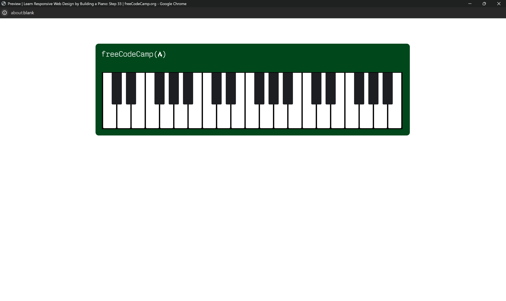

**Piano Project**

**Description:**

This repository showcases the development of a responsive piano interface using HTML and CSS. The project demonstrates the implementation of Responsive Design principles, utilizing media queries and pseudo selectors to ensure optimal display across various screen sizes.

**Preview:**

**How to Run:**

1. Clone this repository to your local machine.
2. Open the `index.html` file in a web browser.

**Contributing:**

Contributions are encouraged! Fork this repository, make your modifications, and submit a pull request.

**License:**

This project is licensed under the MIT License - see the [LICENSE](LICENSE) file for details.